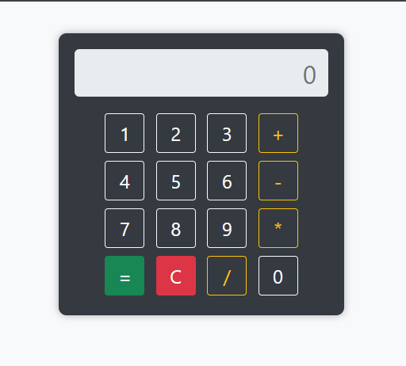

# Clucalculator 🧮

A simple, functional calculator built using **HTML**, **CSS**, and **JavaScript**. This was one of my first projects developed in 2021, designed for basic arithmetic operations with a clean Bootstrap 5 UI.

## 🚀 Features

- Basic arithmetic: `+`, `-`, `*`, `/`
- Clear display with `C` button
- Responsive layout for mobile (Redmi 5 and similar)
- Built with vanilla JavaScript
- Styled with Bootstrap 5 and custom CSS

## 💡 Tech Stack

- **HTML5**
- **CSS3**
- **JavaScript (ES6)**
- **Bootstrap 5**

## 📱 Responsive Design

- Optimized for small-screen devices like **Redmi 5**
- Centered layout with touch-friendly buttons

## 📸 Screenshots

> _You can add a screenshot here to show off the design._  
> For example:  
> 

## 🛠️ How to Run

1. Clone this repository:
   ```bash
   git clone https://github.com/md-ajim/Clucalculator.git

2. Open the index.html file in any web browser.


📅 Created
This project was originally created in 2021 as a beginner-friendly mini-project. It's a reminder of my early development journey and progress in frontend development.

📜 License
This project is open-source and free to use.

---

Let me know if you'd like to include a live demo link or deploy this on GitHub Pages!

    
    
    